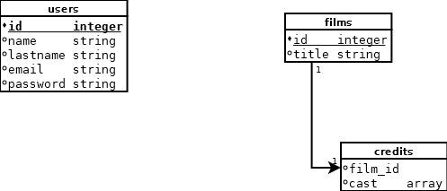

# Proyecto peliculas

## Nombre: Miguel López Fernández

## Preguntas

1. Se insertaría como param query

2. Para el backend se recoge el parámetro de la url. Y se inyecta en la petición a realizar a la API de terceros.

3. Array includes. Realizando un filtrado correcto con la función esto nos permitiria recoger un nuevo array con solo aquellas que cumplan la condición.
Elijo está función por que permite hacer más operaciones por segundo que cualquier otra función. Decisión: https://measurethat.net/Embed?id=450570

## Librerias

### Front

Pinia: Con ella se realiza una gestión de estado de los datos, y nos permite cachearlos y gestionar los datos con mayor facilidad.

Bootstrap: Librería para dar estilos a la herramienta

Vue Lazyload: Librería para realizar el lazy load de imagenes. Con ello nos facilita está tarea

vee-validate y vee-validate/yup : Son librerías para la validación del formulario. Totalmente necesario para que los formularios funcionen correctame y puedas realizar una validación de los campos correctamente.

Vue, VueRouteR: Vue como framework para dessarollar la tarea, y VueRouter por que nos permite realizar una SPA y no tener que cargar constantemente todos los completentos de la herrramienta.

### Back

uuid: para generar automaticamente un id a un nuevo registro sin preocuparnos de la repeticón del id.

node-fetch: para la realización de las peticiones a API's de terceros.

jsonwebtoken: para poder generar el JWT para que los usuarios puedan registrarse y también loguearse.

dotenv: para poder leer las variables de entorno desde un fichero y asi no ponerla a fuego en la herramienta.

bcrypt: para poder encriptar las contraseñas de los usuarios. También para comprobar en el login si la pass enviada coincide con la existente en el registro.

## Documentación

Para poder lanzar la herramienta con exito hay que copiar los .env.example a .env y modificar en ellos los parametros según se necesiten.

## Diagrama
